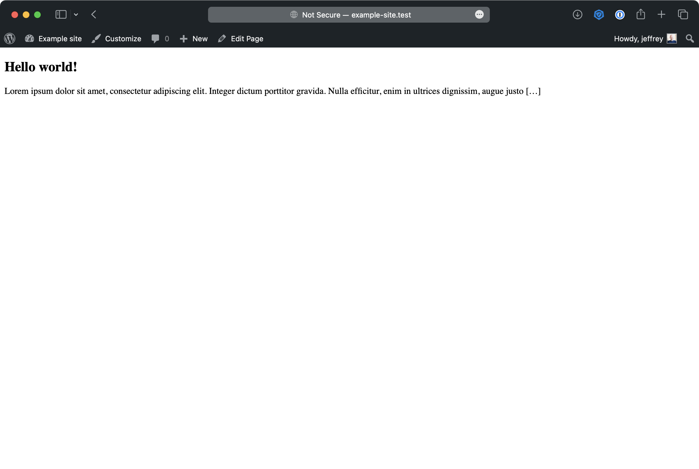
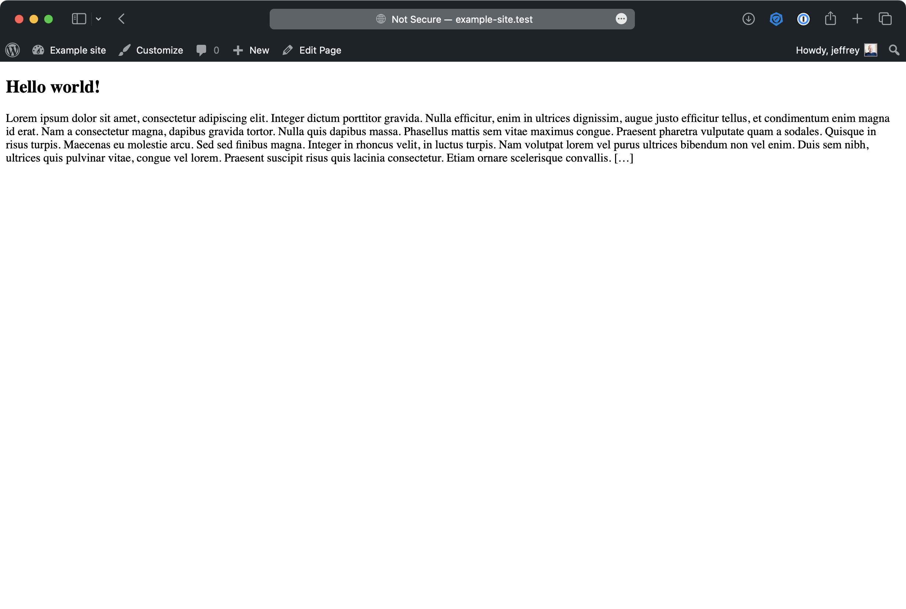

# Gutenberg excerpt limit bug

Theme to reproduce bug.

- Gutenberg v15.2.0
- WordPress v6.1.1

## Reproduce by

Create a page called 'Home' and setting it as the 'Homepage' in Settings -> Reading.

Create a posts with text exceeding the excerpt limit. Example:

```
Lorem ipsum dolor sit amet, consectetur adipiscing elit. Integer dictum porttitor gravida. Nulla efficitur, enim in ultrices dignissim, augue justo efficitur tellus, et condimentum enim magna id erat. Nam a consectetur magna, dapibus gravida tortor. Nulla quis dapibus massa. Phasellus mattis sem vitae maximus congue. Praesent pharetra vulputate quam a sodales. Quisque in risus turpis. Maecenas eu molestie arcu. Sed sed finibus magna. Integer in rhoncus velit, in luctus turpis. Nam volutpat lorem vel purus ultrices bibendum non vel enim. Duis sem nibh, ultrices quis pulvinar vitae, congue vel lorem. Praesent suscipit risus quis lacinia consectetur. Etiam ornare scelerisque convallis. Aenean id nibh eget massa aliquam laoreet quis non ex. Aliquam non tortor et neque placerat tempus eu non sapien.

Nulla sodales sapien ac nisl luctus, nec finibus odio aliquet. Nunc massa neque, ultricies eu elementum non, vehicula at nulla. Vestibulum ante ipsum primis in faucibus orci luctus et ultrices posuere cubilia curae; Donec dapibus enim id varius placerat. Ut vel orci bibendum sem viverra sollicitudin. Sed ullamcorper eros arcu, vehicula pulvinar dui posuere eget. Cras ut nisl sit amet sapien tristique eleifend at vel sapien. Quisque congue, odio vel vestibulum interdum, ex nisl malesuada mauris, ac hendrerit nulla nisi et sem. Nam id risus vestibulum, congue ante in, ornare justo. Vestibulum consequat justo ac eros faucibus, at interdum est placerat.
```

The `front-page.php` contains a custom query to display recent posts.

Result without Gutenberg-plugin active:



Result with Gutenberg-plugin active:


